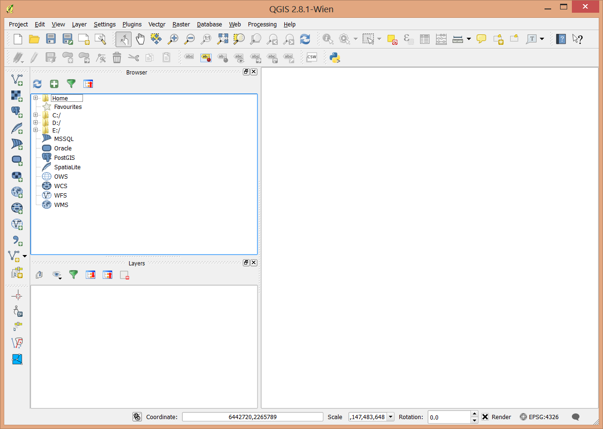

..  _basics:
Basics
======

Much of QGIS should be familiar to those of you with existing GIS experience. Learning to work with QGIS will be largely a matter of learning where tools are located and possibly alternate names for them. The concepts are all the same, and much of the functionality is as well.

There are some places where QGIS is better, or more flexible than ArcGIS, some places where you can accomplish tasks in QGIS freely that require higher level licenses in ArcGIS, and others where ArcGIS is the better tool (Cartography and map production).

The anatomy of QGIS is very similar to ArcMap

Many of the toolbars and windows are dockable so they may move around depending on how you set things up. Here's a view of my version.

The Main Menu with access to settings, plugins, geoprocessing and raster processing menus.

.. image:: graphics/Basics_QGIS_02.png

The map.

.. image:: graphics/Basics_QGIS_03.png

Tools for adding data to the map. Vector data (shapefiles, PostGIS, Spatial Lite), Raster Data (GeoTIFF, img,...), WMS, WFS, CSV, and a very wide variety of other data formats that can be translated by the OGR toolkit into a compatible format.

.. image:: graphics/Basics_QGIS_04.png

A browser that is very similar to the catalog component of ArcGIS.

.. image:: graphics/Basics_QGIS_05.png

A Table of contents that can display layers by order or by source.

.. image:: graphics/Basics_QGIS_06.png

Project Management. A project in QGIS is roughly analogous to a map document (.mxd) in ArcGIS.

.. image:: graphics/Basics_QGIS_07.png

Map navigation. Zoom, pan, and scaling tools.

.. image:: graphics/Basics_QGIS_08.png

Selection and calculation tools:

.. image:: graphics/Basics_QGIS_09.png

Labeling tools

.. image:: graphics/Basics_QGIS_10.png

Editing tools

.. image:: graphics/Basics_QGIS_11.png

Coordinate and projection information.

.. image:: graphics/Basics_QGIS_12.png
