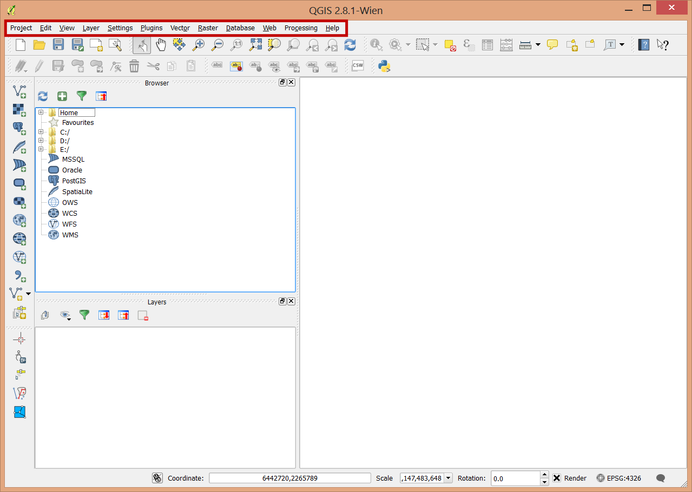

..  _basics:
Basics
======

Much of QGIS should be familiar to those of you with existing GIS experience. Learning to work with QGIS will be largely a matter of learning where tools are located and possibly alternate names for them. The concepts are all the same, and much of the functionality is as well.

There are some places where QGIS is better, or more flexible than ArcGIS, some places where you can accomplish tasks in QGIS freely that require higher level licenses in ArcGIS, and others where ArcGIS is the better tool (Cartography and map production).

Anatomy of QGIS
---------------

.. image:: graphics/Basic_QGIS_01.png

The anatomy of QGIS is very similar to ArcMap

Many of the toolbars and windows are dockable so they may move around depending on how you set things up. Here's a view of my version.

The Main Menu with access to settings, plugins, geoprocessing and raster processing menus.

The map.

Tools for adding data to the map. Vector data (shapefiles, PostGIS, Spatial Lite), Raster Data (GeoTIFF, img,...), WMS, WFS, CSV, and a very wide variety of other data formats that can be translated by the OGR toolkit into a compatible format.

A browser that is very similar to the catalog component of ArcGIS.

A Table of contents that can display layers by order or by source.

Project Management. A project in QGIS is roughly analogous to a map document (.mxd) in ArcGIS.

Map navigation. Zoom, pan, and scaling tools.

Selection and calculation tools:

Labeling tools

Editing tools

Coordinate and projection information.

.. image:: graphics/Basic_QGIS_12.png

Layers
------

Once you've added a layer to the table of contents you can double click on it to get into it's properties.

The tabs along the side allow access to different aspcts of the layer. These are very similar in function to ArcGIS. These include:

* General: Layer name, coorinate reference system, visibility and feature subsets
* Style: Feature symbology
* Labels: Feature labeling
* Fields: The display and types of fields
* Rendering: Simplification of features for display purposes
* Display: Setting popup and default identify behavior
* Actions: User defined layer actions, such as showing an image when a feature is clicked on.
* Joins: Add or remove table joins
* Diagrams: Create charts or diagrams based on the the layer's attributes.
* Metadata: Edit metadata for the layer.

Probably the most notable difference is in how symbology is specified in QGIS.

There are seven types of symbology for vector layers: 

* Single symbol, Categorized, and Graduated. These first three behave much as you'd expect. 
* Rule-based allows you to specify individual rules for displaying features. 
* Point displacement is for specifying the displacement of points based on feature attributes.
* Inverted Polygons, styles everything outside of the features. This is useful for drop shadows or area boundaries.
* The Heatmap renderer generates dynamic heatmaps for point or multipoint layers.

Setting the symbols takes some getting used to. You'll need to specify the fill and the boundary. "No Pen" and "No Brush" are use to indicate that there is either no fill or no outline on features.

Building color ramps takes an extra step that will be described elsewhere.
