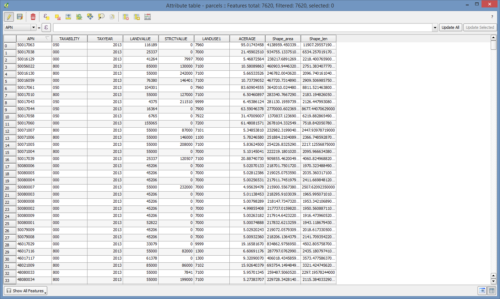
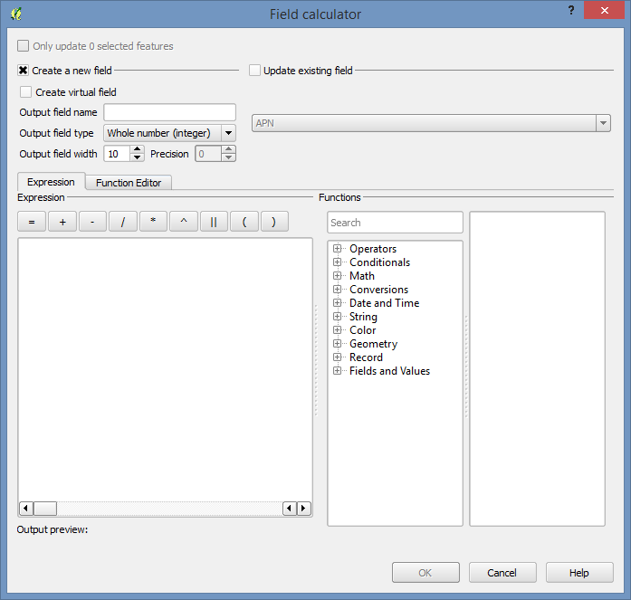
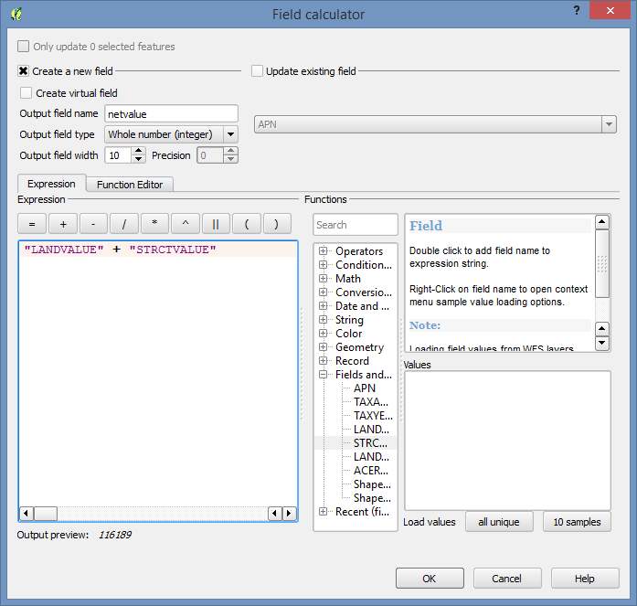
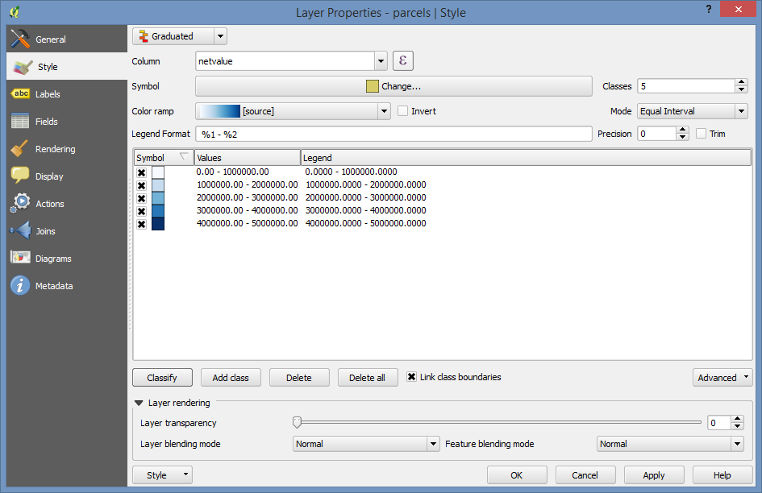
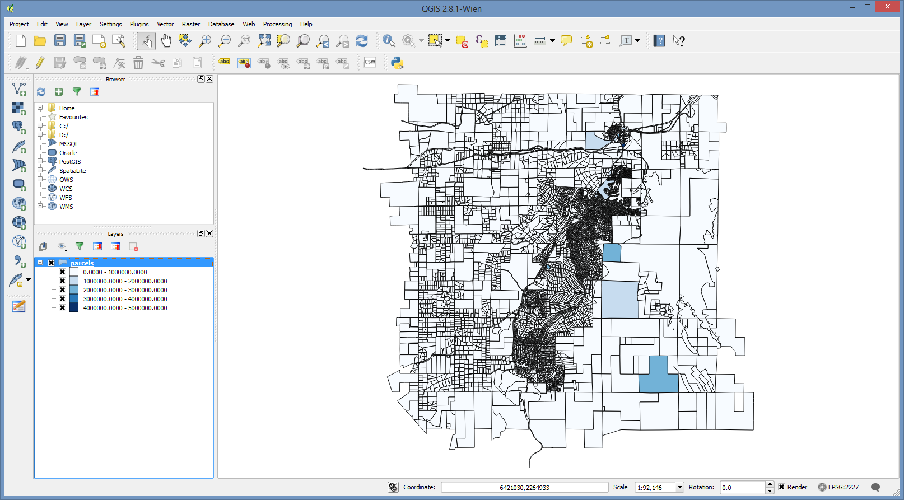
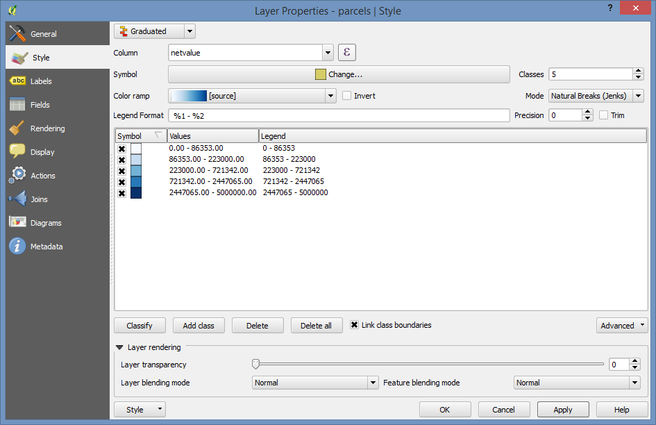
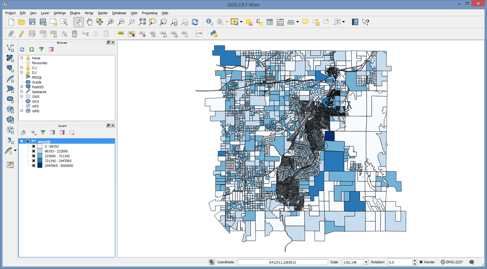
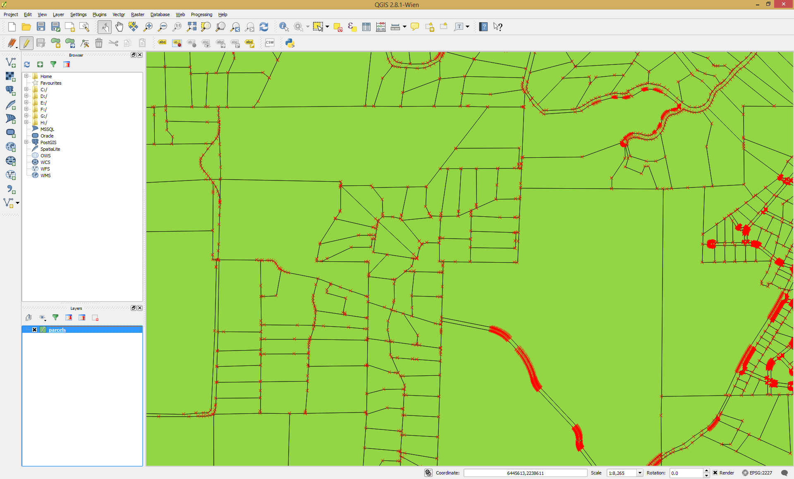
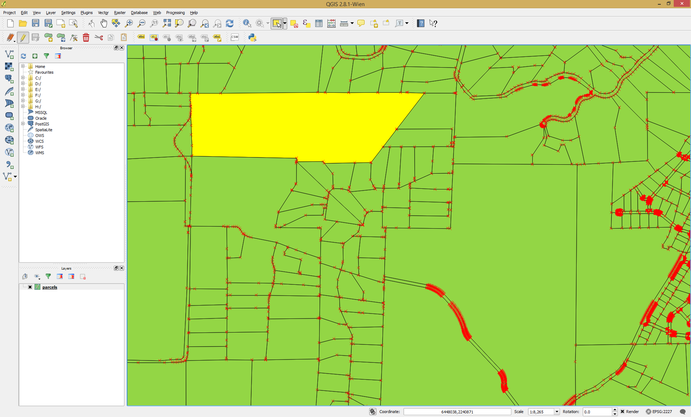

..  _editing:
Editing
=======

Editing in QGIS uses an edit session much like ArcGIS does.  Both attributes and geometries can be edited.

Calculating an Attribute
------------------------

Add the parcel data to the project if it isn't already there. If you're continuing on from the last example, remove any joins using the layer properties to keep things simple.

Open the **parcels** attribute table.

Click on the little pencil at the top left of the attribute table to start an edit session.

Click on the Abacus icon at the far right of the top toolbar to open the calculate field dialog box.

And then fill out the form. We can have it perform the calculation into a new field that will be created to hold the result. An example is shown below.

And click OK to execute the operation.

Then click on the "Save Edits" icon just to the left of the Edit toggle to save the changes and then turn off editing using the pencil again.

Finally, let's set up some symbology based on the field we just calculated.

We'll use a graduated symbol on the **netvalue** field we just created. For the moment, just accept the defaults, and click the "Classify" button.

Then click "OK" to view the results on the map.

That's really not so interesting to view, so let's fix it a bit. Go back into the Style editor (Layer Properties).

And pick the "Natural Breaks" mode on the right side to use the "Jenks" method for splitting the data into the number of classes selected (default = 5).

And click OK to view the results.

Geometry Editing
----------------

**Splitting a Feature**

First toggle editing on using the pencil icon on the editing toolbar. You'll see the vertexes highlighted.

Then select the parcel that you wish to split using the standard selection tools.

