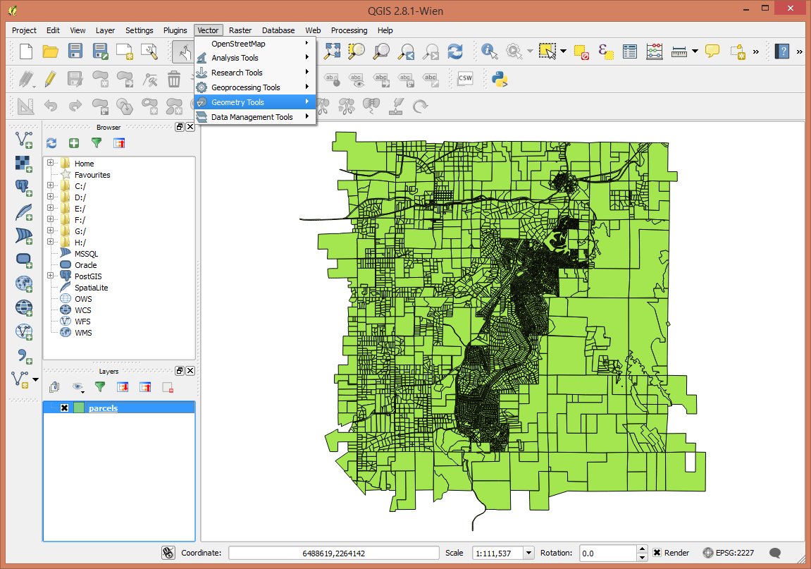
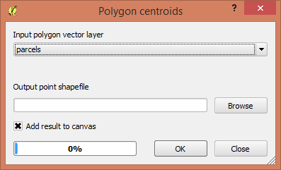
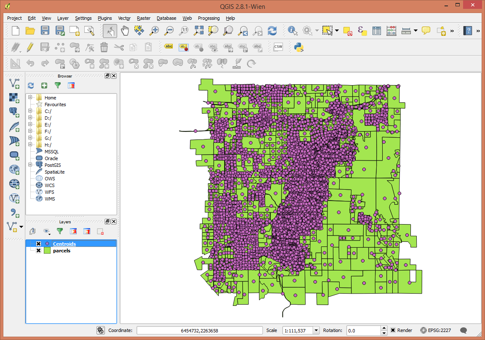
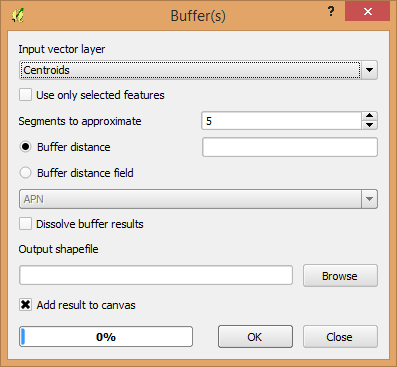
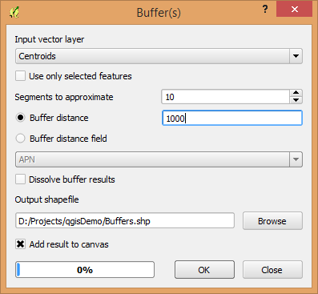
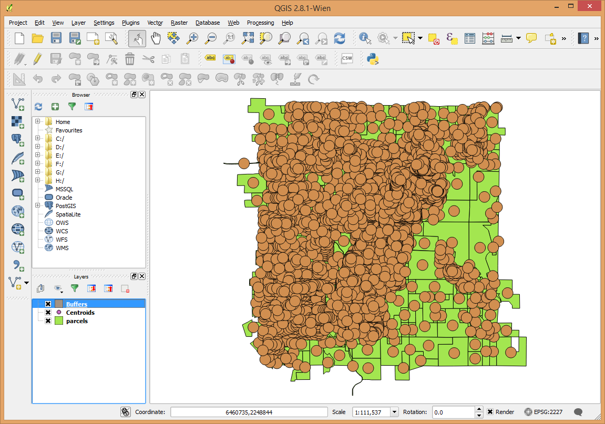
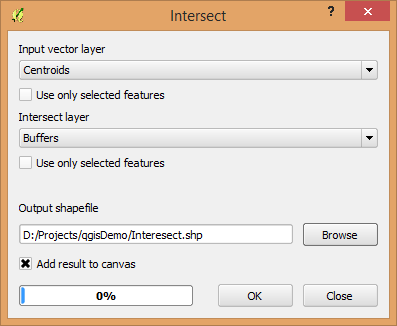
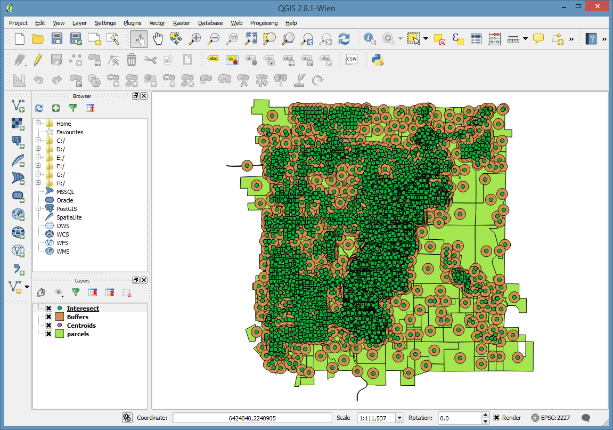
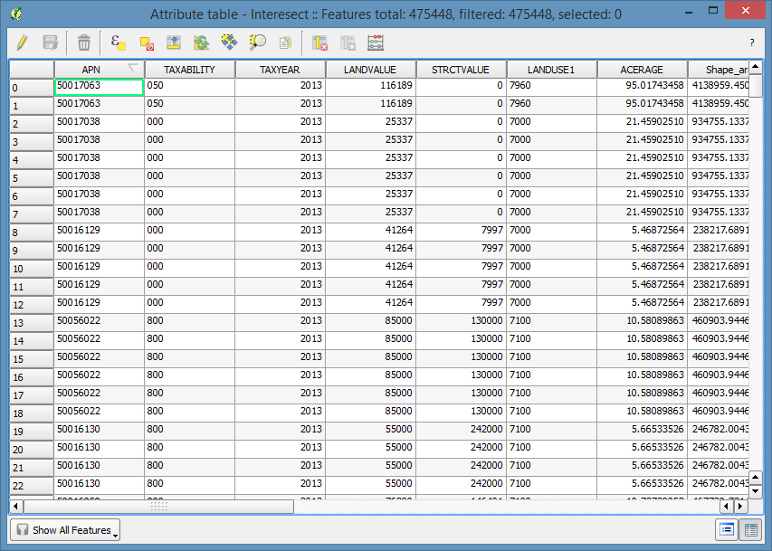

..  _geoprocessing:
Geoprocessing
=============

The concepts for geoprocessing are very similar to those you've learned in ArcGIS. All of the common methods are available:

* Intersect
* Union
* Buffer
* Clip
* Difference
* Dissolve

These are all located under the **Vector** menu.

Create Polygon Centroids
------------------------

Add the parcels layer to your project.

Under **Vector** select **Geometry Tools** and then **Polygon Centroids**.

The image below doesn't show the last portion of menu tree.

Select the layer to create centroids from, and specify the output data set name.

Buffer
------

Buffering the centroids by 1000 feet (because the parcel layer is in State Plane Zone 3 (US Feet))

Find the **Buffer** tool under **Vector**, **Geoprocessing Tools**

The "Segments to approximate" setting allows you to "tune" the detail that corners on the buffer have. The higher the number the more and shorter segments are created.

Intersect
---------

(note I'm going to skip doing this one in the live demo)

Intersecting the centroids with the buffers will start to let us know how many parcels have centroids within 1000 feet of the center of each parcel. This would let us calculate a parcel density, and is a technique that I use frequently when doing summaries of land use.

The **Intersect** tool is in **Vector**,**Geoprocessing Tools**

This process takes a bit longer to run because it's an exponential calculation.

