..  _installation:
Installation
============

QGIS can be run on windows, mac, linux, and android. The instructions below are focused on windows users.

Download the QGIS installer from:
http://www.qgis.org/en/site/forusers/download.html

Note: for windows users, there's a basic installer and an advanced one. The basic installer will be enough for most of you, but advanced GIS users may want to use the advanced installer because it will be easier to install additional features (like Esri File Geodatabase compatibility and development tools).

Basic Installation
------------------

The basic installation should be fairly straight forward and involves a ~290MB download (for the 64bit version) or a ~340MB download (for the 32bit version). Unless you have a 32bit operating system (which is increasingly uncommon now), I advise that you get the 64bit version.

Advanced Installation
---------------------

1. Make sure you've downloaded the OSGeo4W version of the installer. This is a relatively small download because it'll download the components that are needed for your selected options. 
2. Select the Express Desktop Install

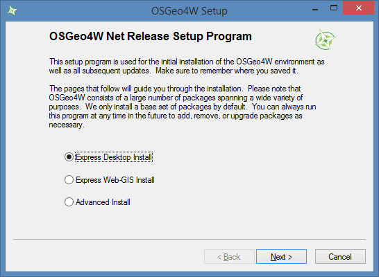

3. Select the Download Site: http://download.osgeo.org 

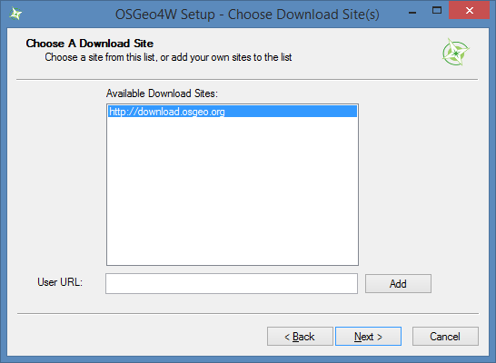

4. Choose the applications to install. I suggest leaving the default. 

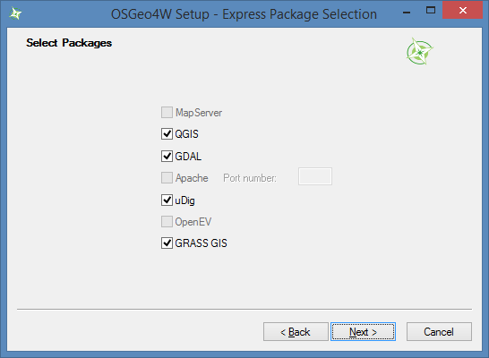

5. Accept the list of unmet dependencies and allow the installter to install them.

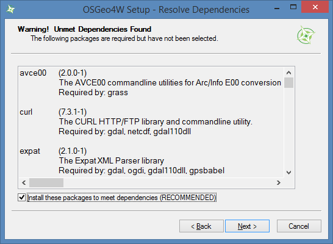

6. Accept any of the "Agreements of Restrictive Package" (there may be more than one)

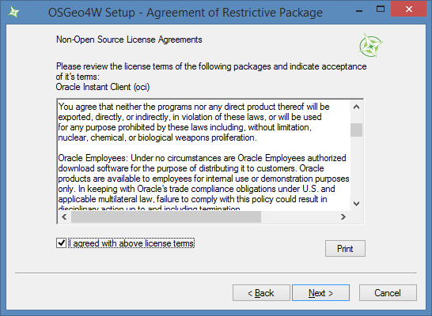

7. The needed components will be downloaded and installed.

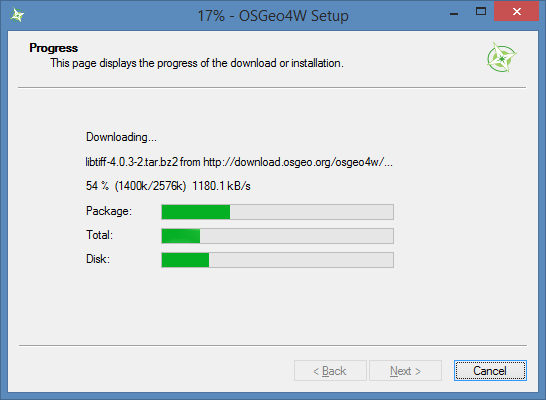

8. Confirm that installation has completed successfully

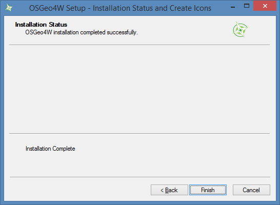

This will give you an installation of QGIS that is effectively identical to the Basic Installation.

You'll note that you also have a new shortcut in your start menue for the "OSGeo4W Setup". If you open this you'll be able to add or remove individual features. There will also be shortcuts for uDIG (another light weight open source GIS desktop application)

Adding File Geodatabase Access
++++++++++++++++++++++++++++++

1. Open the OSGeo4w Setup application and select Advanced Install.

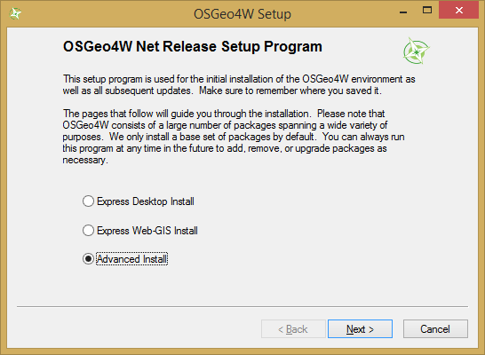

2. Select "install from Internet"

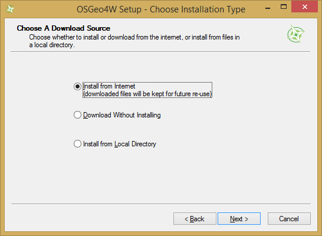

3. Accept the default root install directory, unless you changed it as part of an earlier installation.

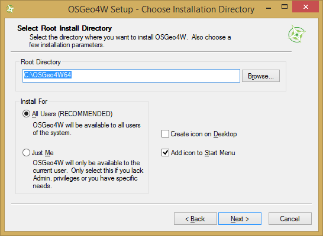

4. Accept the default local package directory, internet connection settings, and download site.

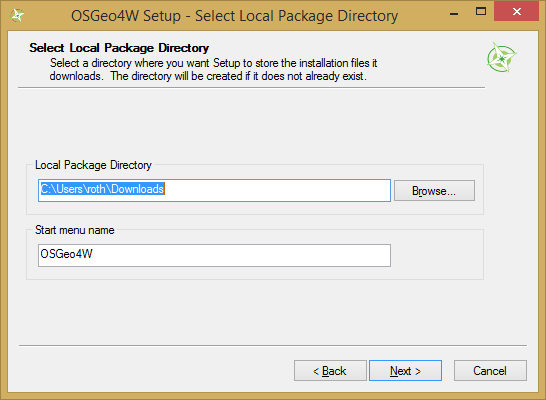

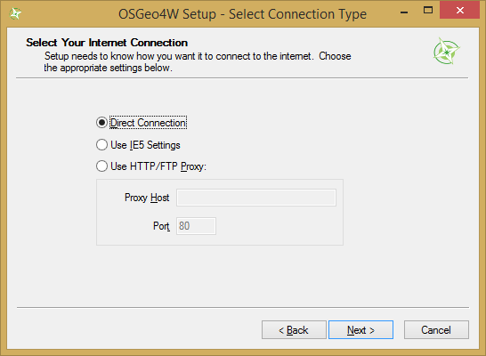

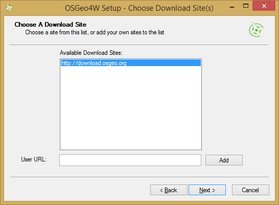

5. You'll then see the Select Packages dialog.

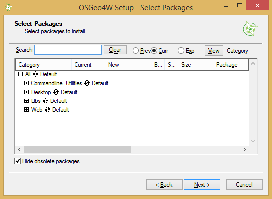

6. Locate the feature you wish to install. In this example we'll find the Esri geodatabase libraries. They're in the "Libs" section. Expand the "Libs" section by clicking on the + sign next to it.

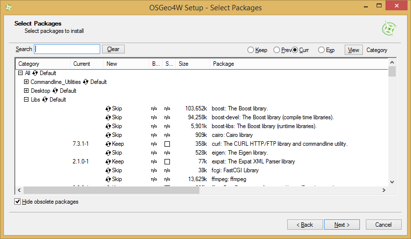

7. Scroll down until you find "gdal-filegdb" under the Package column.

8. Click on the "Skip" under the "New" column and it will change to show the version to be installed. Then click "Next" at the bottom of the screen.

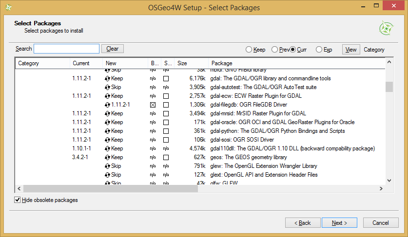

9. Your feature will be downloaded and installed.

