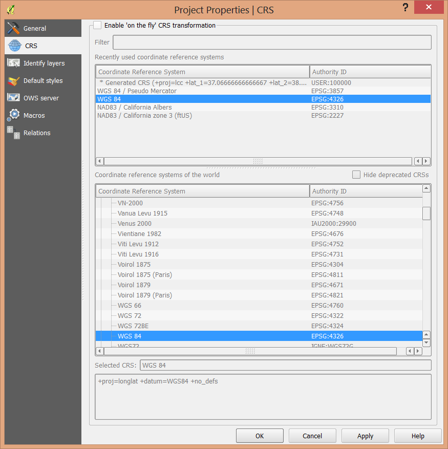
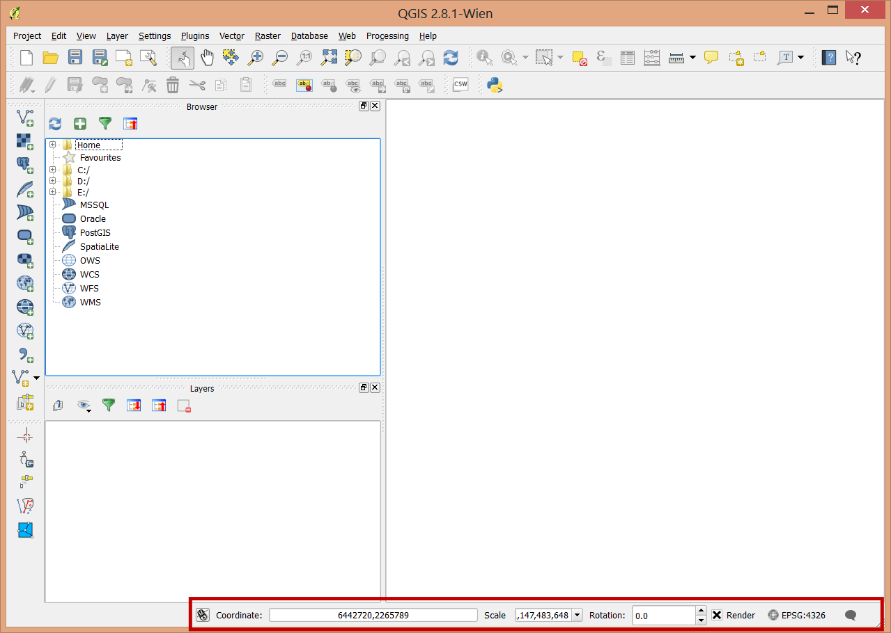
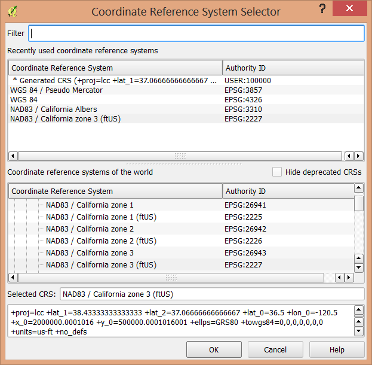

..  _projections:
Projections
===========

Projections take a bit of getting used to in QGIS if you're used to ArcGIS. Most projections are dealt with through specifying their EPSG codes.

QGIS does have a very useful set of tools for searching for and specifying projections and unlike ArcGIS we can turn reprojection on the fly on and off easily.

Project on-the-fly
------------------

Reproject on the fly is not active by default in QGIS. You need to specify a projection for your project and then turn it on in order to use it. I like this feature. It is useful for figuring out projections that are either not specified (missing .prj), or incorrectly specified. 

You can access the project's spatial reference settings either through the main menu, or the button at the bottom right of the screen that shows the EPSG code.

Layer Projections
-----------------

Layers give you a similar dialogue for identifying the projection. This can be accessed through the "General" tab on the layer properties. The spatial reference selector remembers your commonly used projections.

Reprojecting Data
-----------------

To reproject vector layers that are in your table of contents, simply right click on the layer name, select "Save As" and in the save as dialogue, specify the projection to use through the spatial reference selection dialog.

Rasters should be reprojected using the GDAL Warp tools under the *Raster* menu to specify resampling methods and cell sizes. 

EPSG Codes
----------

A very useful site: http://spatialreference.org/ 

Commonly used EPSG codes: (at least commonly used by me)

* 3857: Web Mercator
* 4326: WGS84 (Lat-Long)
* 4269: NAD83 (Lat-Long)
* 3310: California Albers NAD83
* 3309: California Albers NAD27
* 2225: NAD83, California State Plane Zone 1(US Feet)
* 2226: NAD83, California State Plane Zone 2(US Feet)
* 2227: NAD83, California State Plane Zone 3(US Feet)
* 2228: NAD83, California State Plane Zone 4(US Feet)
* 2229: NAD83, California State Plane Zone 5(US Feet)
* 2230: NAD83, California State Plane Zone 6(US Feet)
