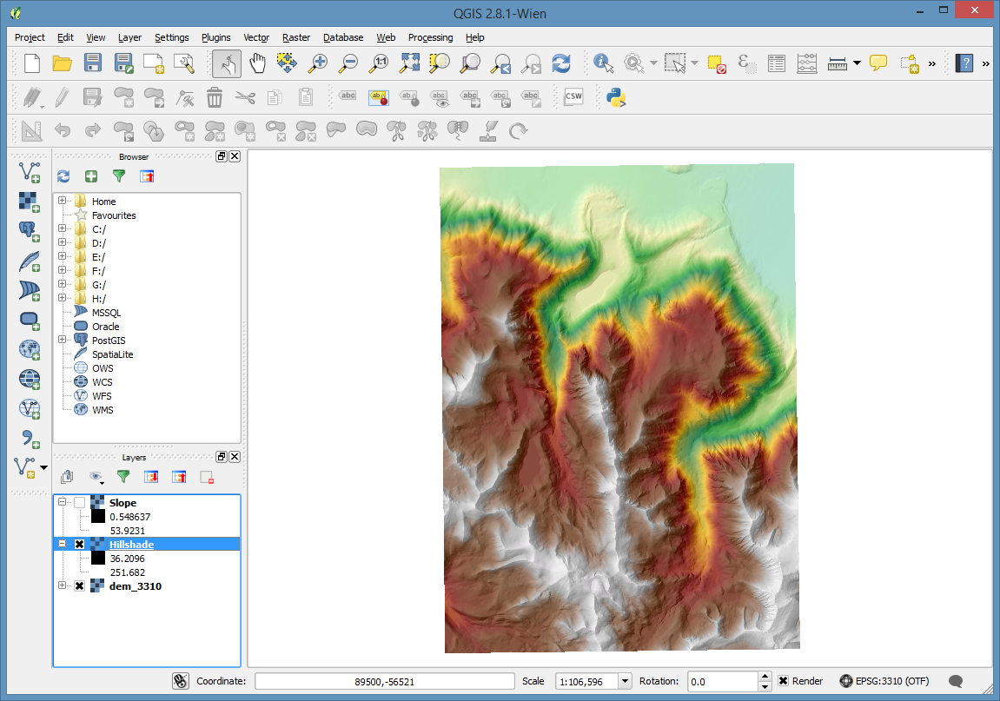

..  _rasters:
Rasters
=======

All of these examples will start from the **dem_4269.Tif** raster in the demo dataset.

Start by adding **dem_4269.tif** to an empty project. Bonus points if you can tell me where it is... Elevation is in meters.

Terrain Processing
------------------

Add the Terrain Analysis Plugin
+++++++++++++++++++++++++++++++

Go to **Plugins**, **Manage and install plugins**

Click on the **Installed** tab on the left. and look for the "Raster Terrain Analysis Plugin", and turn it on with the check box to it's left.

Reprojecting a Raster
+++++++++++++++++++++

Reproject from the current geographic projection (NAD83) (EPSG: 4269) into something a little more friendly for doing terrain analysis (without using Z-factors).

Under the **Raster** menu, go to **Projections** and select **Warp**

I'm going to reproject it to California Albers NAD83 (EPSG: 3310) using the cubic convolution resampling method.

After the reprojection, I'm going to remove the 4269 dem, and set the project's spatial reference to 3310. Set the spatial reference using the button at the lower right corner of QGIS.

Generate a Hillshade
++++++++++++++++++++

Go to **Raster**, **Terrain Analysis**, **Hillshade**

Generate a Slope
++++++++++++++++

The slope is calculated in degrees.

Go to **Raster**, **Terrain Analysis**, **Slope**

Styling
+++++++

By default many of the best color ramps for displaying terrain aren't turned on.

To turn them on, we'll use the **Style Manager**. 

Open the **Style Manager** by going to the **Settings** manu, and selecting **Style Manager** 

Then select the "Color Ramp" tab.

Click on the little green **+** sign to add a new style and select **cpt-city**

.. image:: graphics/Raster_StyleManager_03.png

Then select the **Topography** section.

Scroll down to pick the **wiki-schwartzwald-cont** color ramp. 

Then click **OK** and accept the default name for the gradient and close the style manager.

Last, let's apply it to the dem.

Turn off or reorder the layers so that the dem is visible. I suggest leaving the hillshade on top of the dem.

Double click on the dem layer and go to the layer's Style properties page.

.. image:: graphics/Raster_StyleManager_06.png

Set the **Render type** to **Singleband pseudocolor**, and under "Generate new color map" pick the **wiki-schwartzwald-cont**. Then click the **Classify** button.

Now, Click **OK**

One last step. Let's open the properties for the hillshade layer and go to the **Transparancy** settings. Set the transparancy to about 70%

And click **OK** again. Then turn the layer on.

