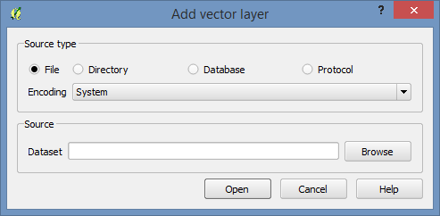
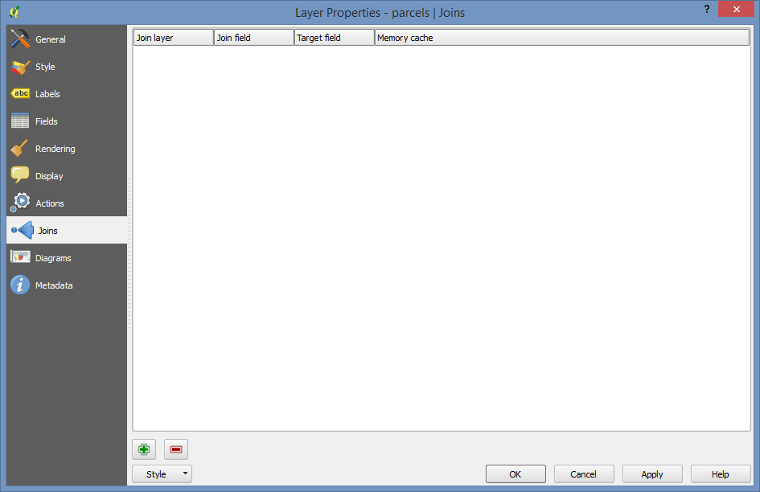

..  _tables:
Tables
======

Tables work very similarly to ArcGIS

The data used below is available at: :ref:`Link <sampledata>`

Adding the Data
---------------

Add the parcels layer to your QGIS project using the Add Vector Layer button.

Use the brows button to find the shapefile.

Also add the land use lookup table (lu_lut.dbf), you can do this through the add vector layers button if you then select "All Files(*).(*.*)" in the bottom right.

Inspect the Data
----------------

Right click on both the parcels shapefile and the look up table and for each select "Open Attribute Table". Look at what is in them. The parcel dataset is just a small portion of a county, and I've reduced the number of fields to keep it small and manageable. There's an APN field, the land and structural value fields, and a land use code. 

The lookup table has a pair of land use code fields that can link to the parcel dataset (we're only going to use one), and another set of land use codes that crosswalks the assessor's land use codes into a standardized land use code that could be used across county borders.

Joining Tables
--------------

Double click on the parcel layer to open the layer's properties, and then click on the "Joins" tab on the left side.

Now click on the little green plus sign near the bottom. Fill out the menu:

* Join Layer: lu_lut
* Join Field: PARUSECODE
* Target Field: LANDUSE1

Now use "Open Attribute Table" on the parcels layer again. If you scroll to the right you'll see the additional fields.

Symbolize
---------

Let's symbolize the parcels layer based on one of the fields we just joined in.

Double click on it again to open the properties and go to the "Style" tab.

Then, select the Categorized style type at the top.

Set the Column to "lu_lut_ANDNAME"

And finally click the "Classify" button below the open window. You'll now have a list of all of the entries in the lu_lut_ANDCODE field and will have random colors assigned to them.

If you now click "OK" you'll have a (probably) garishly colored map of land uses.

Those colors can be cleaned up through the same user interface by clicking the colors and changing them. If you edited them to get a color scheme that you liked, you could save it using the "Style" button at the very bottom of the screen which will open to reveal a "Save Style" option.
